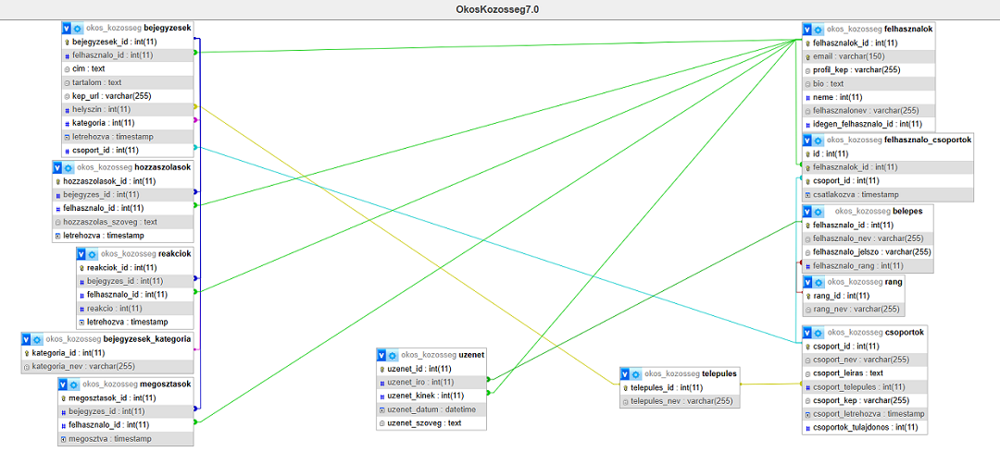
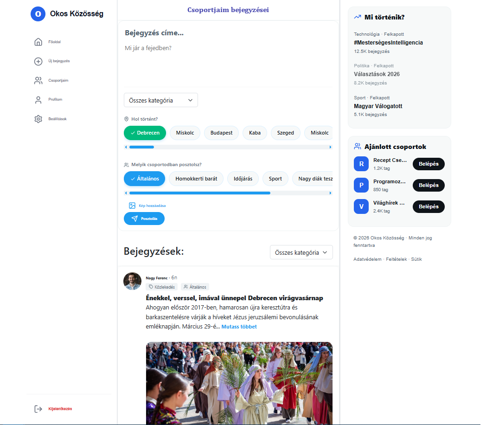
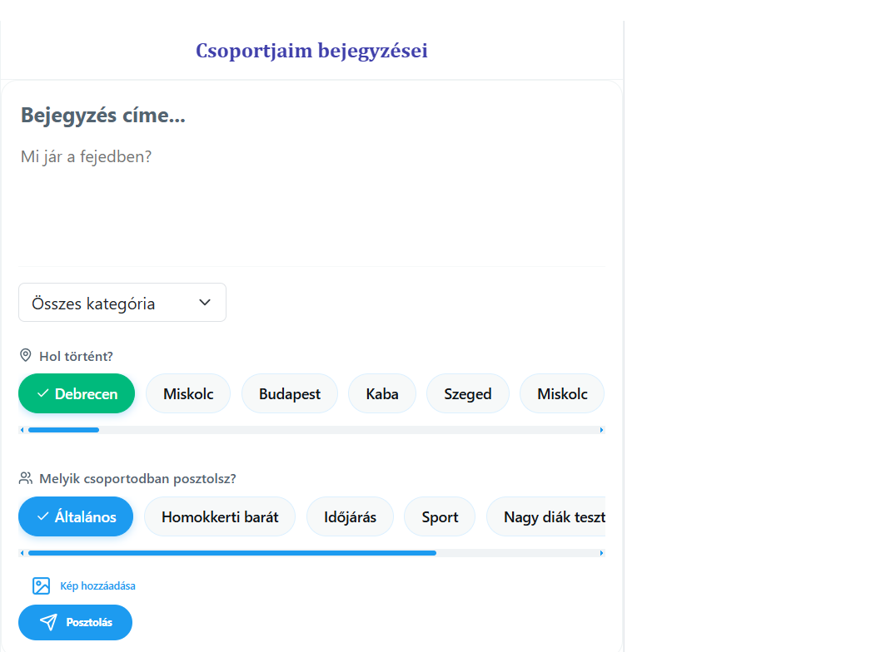
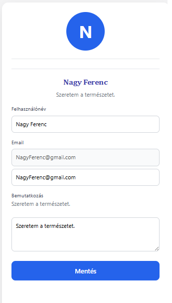
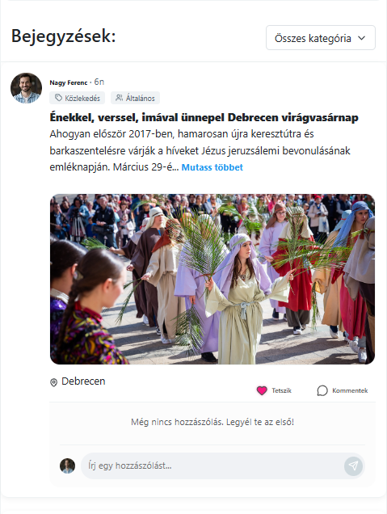

# Az Okos Közösség

## A projekt bemutatása

Az **Okos Közösség** egy közösségi információmegosztó webalkalmazás, amelynek célja, hogy a felhasználók gyorsan és egyszerűen megoszthassanak egymással a mindennapi élethez kapcsolódó információkat.

A rendszer lehetőséget biztosít arra, hogy a felhasználók különböző témákban posztokat hozzanak létre, amelyekre más felhasználók reagálhatnak vagy kommenteket írhatnak. A platform nem privát üzenetküldésre épül, hanem nyilvános közösségi kommunikációra, ahol az információk mindenki számára elérhetőek.

A weboldal célja, hogy segítse az embereket a helyi vagy aktuális események gyors megosztásában. {Például egy felhasználó jelezheti, ha egy utcát baleset miatt lezártak, ha valamilyen esemény történik a városban, vagy ha egy adott helyen fontos információval szeretné ellátni a közösséget.} 

# Készítők

- Komóczi Bence Tibor– Backend fejlesztés és adatbázis tervezés.
- Nagy Sándor – Frontend fejlesztés és admin funkciók.  


---

## Fő funkciók

Az alkalmazás több alapvető funkcióval rendelkezik:

* **Regisztráció és bejelentkezés**
  A felhasználók regisztráció után részlegesen, majd bejelenkezés követően teljesen tudják használni a rendszert. Az első belépés után ki kell tölteniük a profiljukat.

* **Felhasználói profil**
  Minden felhasználó rendelkezik saját profillal, amely tartalmazza:

  * felhasználónevet
  * email címet
  * profilképet
  * rövid bemutatkozást (bio)

* **Posztok létrehozása**
  A felhasználók különböző témákban posztokat hozhatnak létre, amelyek nyilvánosan megjelennek az oldalon.

* **Kommentelés és reakciók**
  A posztokra más felhasználók kommenteket írhatnak, valamint reagálhatnak rájuk, így kialakulhat egy aktív beszélgetés.

* **Csoportok létrehozása**
  A felhasználók saját csoportokat is létrehozhatnak.
  Ezekhez bárki csatlakozhat, mivel a rendszer nem használ csatlakozási kérelmeket. A cél egy nyitott és közvetlen közösség kialakítása.
* **Admin funkciók**
- Felhasználók keresése
- Felhasználók törlése
- Bejegyzések törlése
- Kommentek törlése
- Figyelmeztetés küldése szabályt sértő felhasználóknak
- Bejegyzések keresése személyenként
- Szavakra keresés a kommentek belül és a bejegyzéseken belül
---
## Adatbázis felépítése

Az alkalmazás egy relációs adatbázist használ, amely MySQL alapokon működik.
Az adatbázis célja a felhasználók, bejegyzések és az ezekhez kapcsolódó interakciók strukturált tárolása.

A rendszer több egymással kapcsolatban álló táblából épül fel.



| GET | Magyarázat | POST | Magyarázat |
|----------|----------|----------|----------|
| /felhasznaloim | Az összes felhasználó adatai.| /bejelenkezesAdatai | A felhasználó bejelenkezési adatai.|
| /bejegyzesek | Az összes bejegyzések adatai. |  /posztFelvitel | Poszt létrehozása. | 
| /csoportjaim/:user_id | A felhasználó csoportjai. |  /bejegyKeresCs/:user_id | Bejegyzés keresése a csoportjai szerint. | 


---

## Biztonsági megoldások

A rendszer több biztonsági megoldást is alkalmaz:

* **bcrypt jelszó titkosítás**
* **JWT token alapú hitelesítés**
* szerver oldali adatellenőrzés
* SQL injection elleni védelem paraméterezett lekérdezésekkel

A jelszavak soha nem kerülnek tárolásra sima szövegként, hanem hash formában kerülnek az adatbázisba.

---

## A rendszer működése

A webalkalmazás kliens-szerver architektúrát használ.

1. A felhasználó a frontend felületen keresztül küld kérést.
2. A React alkalmazás HTTP kérést küld a Node.js backendnek.
3. A backend feldolgozza a kérést.
4. Az adatbázisból lekéri vagy módosítja az adatokat.
5. Az eredményt JSON formátumban visszaküldi a frontendnek.

---

## Projekt struktúra

A projekt két fő részből áll:

### Frontend

A frontend React alapú alkalmazás.

Feladata:

* felhasználói felület megjelenítése
* adatok lekérése a backendről
* felhasználói interakciók kezelése








 
### Backend

A backend Node.js és Express segítségével készült.

Feladata:

* API végpontok kezelése
* adatbázis műveletek
* autentikáció
* adatellenőrzés


---

## A projekt célja a gyakorlatban

Az Okos Közösség célja egy olyan online platform létrehozása, ahol a felhasználók könnyen megoszthatják egymással a mindennapi élethez kapcsolódó információkat.

A rendszer támogatja a közösségi kommunikációt, a helyi információk gyors terjedését és az aktív felhasználói részvételt.

**Az Okos Közösség webalkalmazás a saját szellemi termékünk, amely a projektmunka keretében, önálló tervezéssel és megvalósítással készült.**

## Repository klónozása

```bash
git clone https://github.com/Ben-ceh/_Zarodolgozat-2025-2026.git
