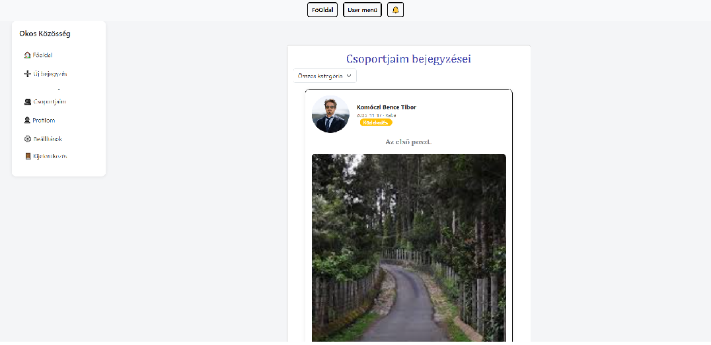

# Az Okos Közösség

## A projekt bemutatása

Az **Okos Közösség** egy közösségi információmegosztó webalkalmazás, amelynek célja, hogy a felhasználók gyorsan és egyszerűen megoszthassanak egymással a mindennapi élethez kapcsolódó információkat.

A rendszer lehetőséget biztosít arra, hogy a felhasználók különböző témákban posztokat hozzanak létre, amelyekre más felhasználók reagálhatnak vagy kommenteket írhatnak. A platform nem privát üzenetküldésre épül, hanem nyilvános közösségi kommunikációra, ahol az információk mindenki számára elérhetőek.

A weboldal célja, hogy segítse az embereket a helyi vagy aktuális események gyors megosztásában. Például egy felhasználó jelezheti, ha egy utcát baleset miatt lezártak, ha valamilyen esemény történik a városban, vagy ha egy adott helyen fontos információval szeretné ellátni a közösséget.

## Fő funkciók

Az alkalmazás több alapvető funkcióval rendelkezik:

* **Regisztráció és bejelentkezés**
  A felhasználók regisztráció után részlegesen, majd bejelenkezés követően teljesen tudják használni a rendszert. Az első belépés után ki kell tölteniük a profiljukat.

* **Felhasználói profil**
  Minden felhasználó rendelkezik saját profillal, amely tartalmazza:

  * felhasználónevet
  * email címet
  * profilképet
  * rövid bemutatkozást (bio)

* **Posztok létrehozása**
  A felhasználók különböző témákban posztokat hozhatnak létre, amelyek nyilvánosan megjelennek az oldalon.

* **Kommentelés és reakciók**
  A posztokra más felhasználók kommenteket írhatnak, valamint reagálhatnak rájuk, így kialakulhat egy aktív beszélgetés.

* **Csoportok létrehozása**
  A felhasználók saját csoportokat is létrehozhatnak.
  Ezekhez bárki csatlakozhat, mivel a rendszer nem használ csatlakozási kérelmeket. A cél egy nyitott és közvetlen közösség kialakítása.

## Adatbázis felépítése

Az alkalmazás egy relációs adatbázist használ, amely MySQL alapokon működik.
Az adatbázis célja a felhasználók, bejegyzések és az ezekhez kapcsolódó interakciók strukturált tárolása.

A rendszer több egymással kapcsolatban álló táblából épül fel.

### Felhasználók

A `felhasznalok` tábla tartalmazza a felhasználók profiladatait:

* email
* profilkép
* bio (bemutatkozás)
* nem
* felhasználónév

Ez a tábla kapcsolódik a `belepes` táblához, amely a bejelentkezési adatokat tartalmazza.

### Bejelentkezési adatok

A `belepes` tábla felelős az autentikációhoz szükséges adatok tárolásáért:

* felhasználónév
* titkosított jelszó
* felhasználói rang

A jelszavak titkosítva kerülnek tárolásra bcrypt segítségével, így a rendszer biztonságosabb.

### Bejegyzések

A `bejegyzesek` tábla tárolja a felhasználók által létrehozott posztokat.

Egy bejegyzés tartalmazhat:

* címet
* szöveges tartalmat
* képet
* kategóriát
* helyszínt
* létrehozási időt
* a létrehozó felhasználó azonosítóját

A bejegyzések több más táblával is kapcsolatban állnak.

### Kommentek

A `hozzaszolasok` tábla tartalmazza a bejegyzésekhez írt kommenteket.

Minden komment kapcsolódik:

* egy bejegyzéshez
* egy felhasználóhoz
* egy létrehozási időponthoz

Ez lehetővé teszi a felhasználók közötti kommunikációt a posztok alatt.

### Reakciók

A `reakciok` tábla tárolja a felhasználók reakcióit egy adott bejegyzésre.

Ez például lehet:

* tetszik
* egyéb reakciók

A rendszer így lehetőséget ad gyors visszajelzésre a posztokkal kapcsolatban.

### Megosztások

A `megosztasok` tábla tárolja, ha egy felhasználó megoszt egy bejegyzést.

Ez segíti az információk gyorsabb terjedését a közösségen belül.

### Csoportok

A `csoportok` tábla tartalmazza a felhasználók által létrehozott közösségeket.

Egy csoport rendelkezik:

* névvel
* leírással
* csoportképpel
* településsel
* létrehozási idővel
* tulajdonossal

A felhasználók csatlakozását a `felhasznalo_csoportok` tábla kezeli.

### Kategóriák

A `bejegyzesek_kategoria` tábla tartalmazza a különböző posztkategóriákat, amelyek segítik a bejegyzések rendszerezését.

### Települések

A `telepules` tábla tartalmazza a rendszerben szereplő településeket.
Ez lehetővé teszi, hogy a csoportok vagy bejegyzések egy adott helyhez kapcsolódjanak.

| GET | Magyarázat | POST | Magyarázat |
|----------|----------|----------|----------|
| /felhasznaloim | Az összes felhasználó adatai.| /bejelenkezesAdatai | A felhasználó bejelenkezési adatai.|
| /bejegyzesek | Az összes bejegyzések adatai. |  /posztFelvitel | Poszt létrehozása. | 
| /csoportjaim/:user_id | A felhasználó csoportjai. |  /bejegyKeresCs/:user_id | Bejegyzés keresése a csoportjai szerint. | 

---

## Biztonsági megoldások

A rendszer több biztonsági megoldást is alkalmaz:

* **bcrypt jelszó titkosítás**
* **JWT token alapú hitelesítés**
* szerver oldali adatellenőrzés
* SQL injection elleni védelem paraméterezett lekérdezésekkel

A jelszavak soha nem kerülnek tárolásra sima szövegként, hanem hash formában kerülnek az adatbázisba.

---

## A rendszer működése

A webalkalmazás kliens-szerver architektúrát használ.

1. A felhasználó a frontend felületen keresztül küld kérést.
2. A React alkalmazás HTTP kérést küld a Node.js backendnek.
3. A backend feldolgozza a kérést.
4. Az adatbázisból lekéri vagy módosítja az adatokat.
5. Az eredményt JSON formátumban visszaküldi a frontendnek.

---

## Projekt struktúra

A projekt két fő részből áll:

### Frontend

A frontend React alapú alkalmazás.

Feladata:

* felhasználói felület megjelenítése
* adatok lekérése a backendről
* felhasználói interakciók kezelése

### Backend

A backend Node.js és Express segítségével készült.

Feladata:

* API végpontok kezelése
* adatbázis műveletek
* autentikáció
* adatellenőrzés

---

## A projekt célja a gyakorlatban

Az Okos Közösség célja egy olyan online platform létrehozása, ahol a felhasználók könnyen megoszthatják egymással a mindennapi élethez kapcsolódó információkat.

A rendszer támogatja a közösségi kommunikációt, a helyi információk gyors terjedését és az aktív felhasználói részvételt.
